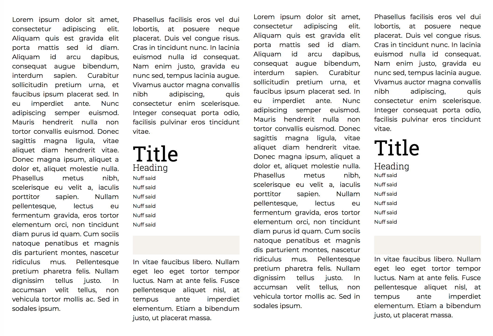

We're in the middle of a large platform migration, and with that, a chance to rework a lot of our style system. We're using [SMACSS](https://smacss.com/) as an organizational paradigm; we decided not to go for React and styled components since we're focusing on time to first paint for users who've never been to our site before, not just returning users who will have assets cached. Done right, browsers using raw HTML can still get a display in front of a user in less time than a frontend app framework can.


What I want to talk about though is the process of building out a vertical rhythm.

Traditionally, type is measured from baseline to baseline. That's the "leading" measure of the type. It's the line the English-speaking reader sees when looking at text; it's the most consistent alignment of objects and  so that's where we gravitate to. Descenders drop below it, but human brains treat those as exceptions. All of this ends up meaning that layouts set with that in mind look really sharp.

However, type on the web made some ugly compromises. Type there is measured top to bottom, including the ascenders and descenders. Most fonts are encoded with large gaps below their baselines, and there's no exposure of this information into CSS. The only way to deal with this is to either measure or assume things about the position. In the age before web fonts, you didn't know which font you were going to get, so measurement is out. Assumption only works in the most simple circumstances (most newspaper roman are pretty similar), so until the era of web fonts, baseline to baseline layouts were not possible on the web unless you can align things on a shared baseline only by using `display: inline` elements, and letting the browser align the baselines.

Which gets us to the problem of columns and other side-by-side layouts. 



Which of these looks better? The two columns on the left, or the two columns on the right? Look at the headings and fine print there. Everything snaps to the same baseline the left column has. The image placeholder doesn't have a gap big enough for a whole line of text above it, and leaves a little more room below it so the paragraph below isn't impinged.

Web fonts now exist, and they allow us to make the realistic assumption that our type will be displayed in the typeface we select. This opens new possibilities, like using the centuries old layouts that are what make old books and well set type so much more crisp and attractive than web pages usually are.

Form inputs and other elements with top borders (including horizontal rules, which essentially are the top border only) can start at a baseline. Everything stays crisp and well aligned. Elements end a bit before the next baseline, or get a full line's space afterward.

## First try at implementation

Our first attempt at getting this right was using `position: relative` to shift text down so its baseline lined up with the bottom of the element. 

```css
.f-body { font-size: 16px; line-height: 20px; font-family: Montserrat;
	position: relative; top: 6px }
.f-caption { font-size: 13px; line-height: 20px; font-family: Montserrat;
	position: relative; top: 10px }
```

It works great—if all you have on your page is text. block elements so contained shift down as well, meaning the only way this can work is if every textual element has its own instantiation of this class. Using such a system is tedious in the extreme.

## Second try at implementation

The second attempt was using margins, positive on top and negative on bottom on textual elements to shift future elements upward so they started at the previous baseline, rather than the previous descender line.

```css
.f-body { font-size: 16px; line-height: 20px; font-family: Montserrat;
	margin-top: 6px; margin-bottom: -6px; }
.f-caption { font-size: 13px; line-height: 20px; font-family: Montserrat;
	margin-top: 10px; margin-bottom: -10px; }
```

This was pretty practical for a while. Margin collapse did the right thing when text elements abutted other text elements. Block elements could have margins adjusted so they too created a similar rhythm.

The downfall was margin collapse. Because CSS doesn't have a `margin-collapse: collapse` property, only inline and block elements respect margin collapsing. This means that any `display: flex`, `display: inline-block` or `display: table` elements would need different margin adjustments followed by text than they would followed by other block elements. In a flex-heavy application design, that fails. (CSS spec nerds: someone want to write a spec for `margin-collapse` ? )

## Third time's the charm

The third try worked: we defeated margin collapsing by using padding for the top and margins on the bottom (because margins can be negative but padding cannot)

```css
.f-body { font-size: 16px; line-height: 20px; font-family: Montserrat;
	padding-top: 6px; margin-bottom: -6px; }
.f-caption { font-size: 13px; line-height: 20px; font-family: Montserrat;
	padding-top: 10px; margin-bottom: -10px; }

```

Everything aligns nicely. The math works out decently. We're looking forward to sharp, well-typeset layouts for our new application design.

The margin and padding values were derived experimentally, using a grid to see how text laid out and nudging it until it aligned, because the baseline to bottom of the type isn't exposed where we can see it.